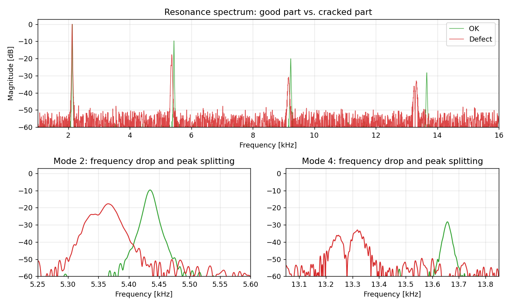
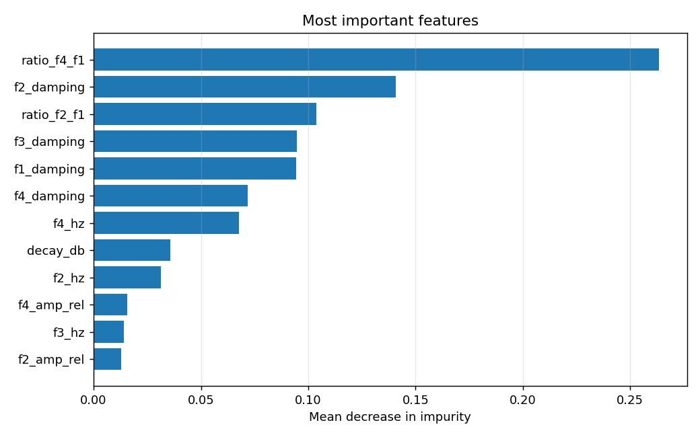
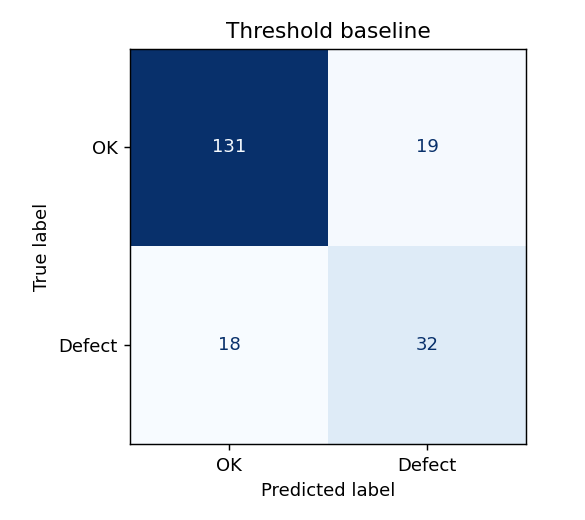
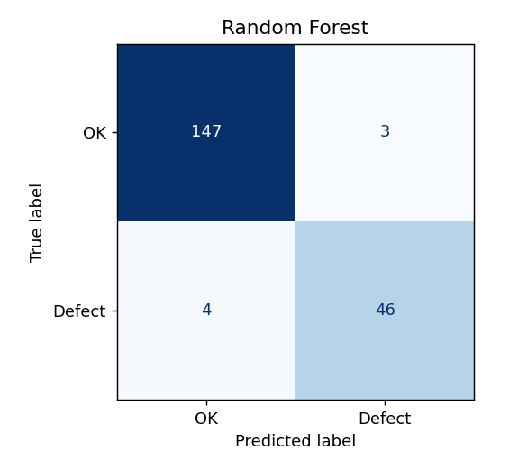

# ART defect classifier: acoustic resonance testing with Random Forest

Automatic detection of cracked parts from their acoustic resonance "fingerprint", using physically interpretable spectral features and a Random Forest classifier.

> **About this repository.** This is a clean, self-contained demonstration of the method I developed and applied to railway components during my industrial PhD; a first account was presented at the conference *Transport of the 21st Century* (Warsaw University of Technology, 2025), and a full paper is under review at *Production Engineering* (Springer Nature); see [ORCID](https://orcid.org/0009-0003-0454-0848). Industrial measurement data cannot be published, so this repository uses **physics-based synthetic signals**. The numbers below describe the synthetic benchmark, not the results reported in the paper.

## The problem

In acoustic resonance testing a part is struck lightly and its ringing is recorded. Every part rings at its natural frequencies; a crack lowers local stiffness, which shifts some of these frequencies down, increases damping and can split a resonance peak in two.

The classic industrial approach sets a threshold on one natural frequency. It fails in practice because **good parts are not identical**: tolerances in geometry and material move all frequencies up or down together, and this scatter overlaps with the shift caused by small cracks. The result is either missed defects or unnecessary rejects.



## Approach

1. **Signal model** (`art/simulate.py`): each part is a sum of exponentially damped modes with realistic manufacturing scatter, tap-to-tap variation and measurement noise. Cracks of random severity lower mode frequencies (by a different amount per mode), raise damping and may split peaks.
2. **Feature extraction** (`art/features.py`): for each expected mode, the peak frequency, relative amplitude, damping (from the half-power bandwidth) and number of peaks; plus **frequency ratios** to the first mode, spectral centroid and decay. All features have a physical meaning, so an inspector can see why a part was rejected.
3. **Classifier** (`train.py`): Random Forest with class weighting for the rarer defective class, 5-fold stratified cross-validation, evaluation on a held-out test set and comparison with the single-threshold baseline.

## Results on the synthetic benchmark

800 parts (600 good, 200 cracked), 25% held out for testing:

| Method | Defect recall | False reject rate | Balanced accuracy |
|---|---|---|---|
| Threshold on 2nd natural frequency | 64% | 13% | 0.76 |
| Random Forest (21 features) | **92%** | **2%** | **0.95** |

The few defects the model misses are the smallest cracks (mean severity 0.16 vs. 0.50 for all defects), which is the expected physical limit of the method.

The most informative features are **frequency ratios**: they cancel out the common scatter of good parts and isolate the crack-induced shift of individual modes. Damping estimates come next.



| Threshold baseline | Random Forest |
|---|---|
|  |  |

## How to run

```bash
pip install -r requirements.txt
python train.py              # simulate data, train, evaluate, save plots to docs/
python predict.py --demo     # classify one simulated good and one cracked part
python predict.py tap.wav    # classify a real tap recording (mono WAV)
```

## Project structure

| Path | Purpose |
|---|---|
| `art/simulate.py` | Physics-based synthetic impulse responses of good and cracked parts |
| `art/features.py` | Spectral feature extraction |
| `train.py` | Training, cross-validation, baseline comparison, plots and metrics |
| `predict.py` | Classification of a single recording |
| `docs/` | Generated plots and `metrics.json` |

## Tech stack

Python, NumPy, SciPy, pandas, scikit-learn, Matplotlib.

## Author

Samuel Szulc, [LinkedIn](https://www.linkedin.com/in/samuel-szulc-725345107/)
